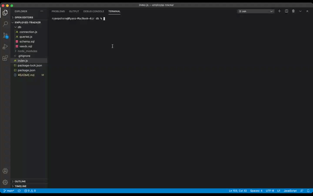
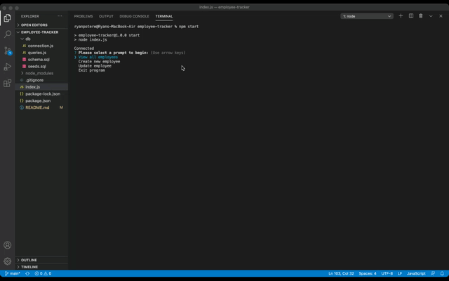
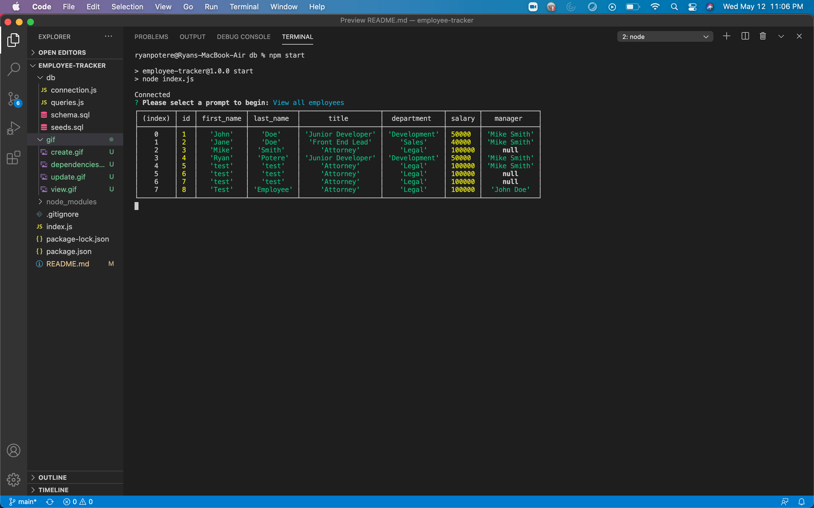
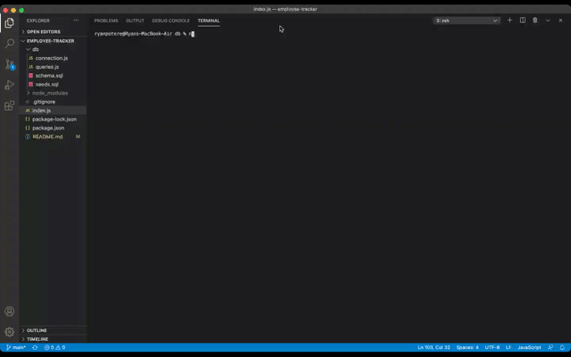

# Employee-Tracker 

  ## **Table of Contents**
  1. [license](#license)
  2. [Description](#description)
  3. [Installation Instructions](#installation-instructions)
  4. [Usage information](#usage-information)
  5. [Contribution Guidelines](#contribution-guidelines)
  6. [Test Instructions](#test-instructions)
  7. [Questions?](#questions)

  ## **License:** 
 

  This application is covered under license type: MIT

  ## **Description:** 
 This command line prompt program will allow the user to enter a new employee into the data base, select their position which will have a relationship to a certain department. The user is able to select the new employees manager and save this information to the database. The user is able to edit any user's job title in the database which will then update the database. The user is also able to view all employees that are currently in the database. This will show their current title, the department they belong to, their salary and their current manager.  https://github.com/rjpotere/employee-tracker

 
 
 
 
  ## **Installation Instructions:**
 Run nmp i to install dependencies. 

 

  ## **Usage Information:** 
This program can be used to keep track of the amount of employees a company has, and how much money is on their payroll. 

  ## **Contribution Guidelines:**
 n/a 

  ## **Test Instructions:** 
n/a

  ## **Questions:**

  Github Profile: [Rjpotere](https://github.com/Rjpotere).

  Contact me by email with additional questions: [Ryan.potere@gmail.com](mailto:Ryan.potere@gmail.com)
